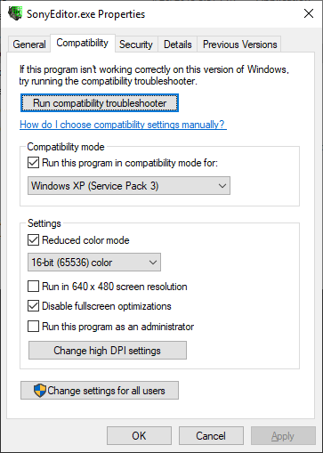
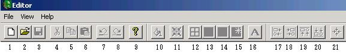
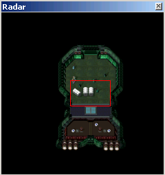
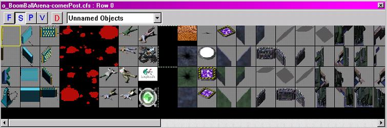
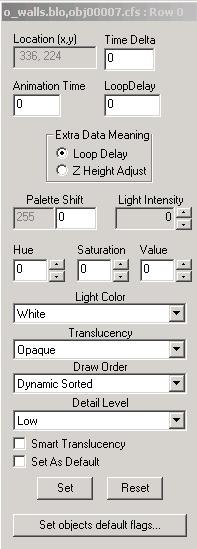
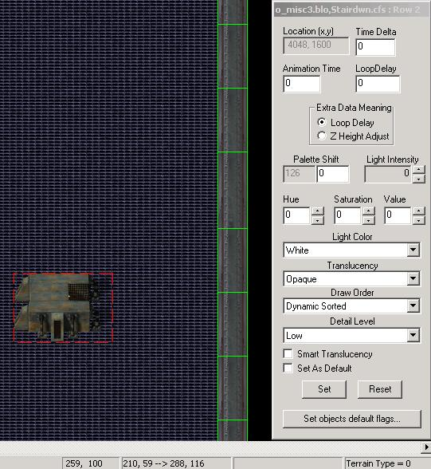
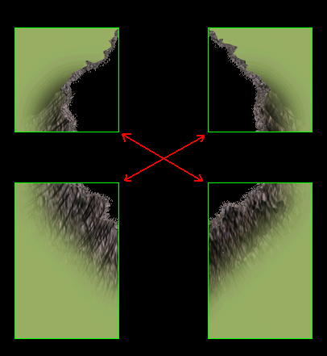
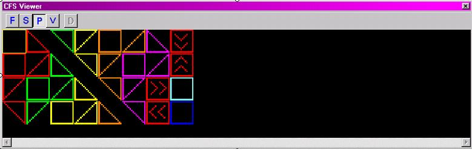
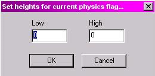
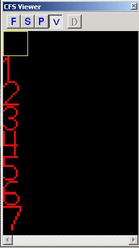

Setup
=====

> Before extracting the map editor, create a new folder in the infantry
> directory and name it “Editor”. After unzipping, please place the map
> editor in this newly created folder. You’ll also need to copy all f\_
> and o\_ `.blo` files (O for objects and F for floors) from your
> Infantry directory into this folder. The `.BLO` files contain all of
> the game's visual assets such as Sprites and Floor Tiles.
>
> **Note:** Some maps may also require the older `.lvb` files which are
> essentially BLO files.

Before you open the editor, you’ll need to change your editor's
compatibility settings:  
- Compatibility Mode: Windows XP SP3  
- Reduced color mode: “16-bit (65536) color”. *If you do not, your map work
area will be filled with green and purple textures.*  
- Disable fullscreen optimizations

**Example:**  
  
If the editor crashes when opened, Right click and select Properties.
Under the Compatibility tab check the box that reads “Disable visual
themes”.

---

User Interface
--------------

Let’s begin by taking a few moments to get familiar with the various
buttons and their functionality.

1.  New File
2.  Open File
3.  Saves File
4.  Cut
5.  Copy
6.  Paste
7.  Undo
8.  Redo
9.  Help
10. Fill
11. **Snap to On/Off** - When on, Sprites snap to the grid, which is a grid
    of 16x16 pixcls.
12. **Grid Overlay On/Off** - When active, a grid is overlayed across the
    Map View window to assist in alignment and positioning of sprites.
13. **Palette Window On/Off** - When active, the CFS viewer is present.
14. **Radar View On/Off** - When active, the Radar view is present.
15. **Refresh Radar View** - When toggled, the Radar view is updated.
16. Set Defaults
17. **Align Left** - When active, this function aligns all selected sprites
    to the snap-to grid depending on the alignment chosen.
18. **Align Right** - When active, this function aligns all selected sprites
    to the snap-to grid depending on the alignment chosen.
19. **Align Top** - When active, this function aligns all selected sprites
    to the snap-to grid depending on the alignment chosen.
20. **Align Bottom** - When active, this function aligns all selected
    sprites to the snap-to grid depending on the alignment chosen.
21. **Align centers** - When active, this function aligns all selected
    sprites to the snap-to grid depending on the alignment chosen.

When you create a new map, you’ll notice two smaller windows appear on
your screen. One is the Radar view and the other is your CFS viewer. The
radar overview is essentially your mini map. The red rectangle will show
what you’re currently focused on. It’s good to refresh your radar as you
progress so you can see the changes made to the entire map. To refresh
the Radar, toggle the “Refresh Radar” button on your tool bar.

---

Radar
-----

The CFS viewer (the second window on your screen) is what you’ll use to
select your objects, vision, physics, and floor tiles. To switch between
these fields, just click on the letter assigned to them. The legend for
these is displayed below:

- **F** - Floor Tiles
- **S** - Objects or Sprites
- **P** - Physics Tiles
- **V** - Vision Tiles

---

CFS Viewer
----------

Sprites, Physics and Vision Overlays are all placed or painted into the
Map View window. In the case of sprites, they are dragged from the
Sprite Palette to the Map View. Physics and Vision Tiles are selected,
then “painted on” using the left mouse button. Now might be a good time
to scroll through the various objects and tiles, there are literally
hundreds of assets to choose from. If you wanted to test out the
placement of said objects, feel free. Please note you can delete any
placed object by simply selecting it and pressing your “Delete” key.

---

### Properties Window

The properties window will appear anytime a Sprite is placed, such as a
wall, box, pipe etc. From here, you can determine the properties of any
placed Sprite on your map.

Let’s take a look at the options on the Properties Window starting from
the top:

**Location(x,y):** In this box will be the map coordinates of the said
placed Sprite. This field cannot be edited.  
**Time Delta:** The time in ticks that an animated sprite will wait to start  
**Animation Time:** The time in ticks that an animated sprite will play
through one animation set.  
**Loop Delay:** The delay in ticks that an animated sprite will wait to
play through the next animation set. Extra Data Meaning: This is a
switch that tells the bltter whether the Loop Delay is used for delay,
or as a Z Height adjustment.  
**Palette Shift:** This is an unused function for palette shifting sprites.
Light Shift: This sets the value of a light palette sprite.  
**Hue:** Changes the color of the selected object.  
**Saturation:** This option determines how much color is in the selected
object.  
**Value:** This determines how bright you want the selected object
to be.  
**Light Color:** Sets the color of light palette sprites.  
**Translucency:** Sets the degree of alpha blend on the selected sprite.

---

### Draw Order

- **Static First** - Drawn underneath (first) the player sprite
- **Static Sorted** - Drawn Above Static First, but under Player
- **Static Last** - Drawn above Static Sorted, but under Player
- **Dynamic First** - This allows a sprite to be animated. This level is drawn above all Static
Sprites, but under Player.
- **Dynamic Sorted** - This is the same plane as the player, all sprites at this level sort with the player sprite.
- **Dynamic Last** - This layer is drawn last, and overlays the player. This
option determines the order objects appear on the screen and also if the
player can walk over, under or through the placed object.
- **Detail Level** - This determines the detail level of any selected object. The
options are low, medium and high. By default the option is set to low.

**Smart Translucency:** This sets the smart translucency function
whereby the sprite goes translucent at a certain distance from the
player (in pixels) as defined in the zone `.cfg` file.  
**Set:** Sets the options selected as defaults.  
**Reset:** Resets options back to default
setting.  
**Set Objects default flags:** When selected this sets the current
properties as the default values for all like sprites.

Now, let’s start making your map. It’s recommended that you start by
placing your walls first. If mistakes are made, no problem, you can
simply reshape or redo them at any time. Click on the CFS Viewer, hit
the “S” button and use the drop down menu to scroll through the various
assets. Sprites such as walls can be found in a number of places such as
“2SWalls” or any of the “WallSets”. To place Sprites, simply select the
object from the CFS viewer and drag it to your map.

Above, we see a selected Sprite and the properties window. You’ll be
able to tell when an object is selected as the properties window will
always be displayed and said selected object is encompassed in a red
rectangle. To unselect, simply click on another Sprite.

One important thing to note is some objects needs to be placed in
relation to another object. Think of it as a large jigsaw puzzle. There
are so many sprites and lots of combinations, so by all means, take your
time.

Once the walls are finished, select your floor tiles of choice and have
at it. It’s important to note when placing floor tiles that you have the
“Fill Selection” option turned off. You can toggle this option on/off
under **`Edit` > `Fill`** Selection or, simply hit **`Ctrl+F`**. If you do not,
you’ll be prompted by the editor that the tile option you’ve selected
will fill over 200 tiles. This will encompass the entire map with the
same texture. If this is not the desired effect, simply go to
**`Edit` > `Undo`**. Make sure to fill all corners and make sure that the tiles
do not exceed beyond your rooms. Afterwards, you can go back and add
other objects to spruce up your map.

If you’ve finished adding walls, floors and landscapes, you can move on
to adding physics to your map. When the Physics Button is pressed, the
CFS viewer window will change to the Physics Palette. These tiles define
the physics overlay and are all definable by right clicking on them.

---

### Physics Palette

All physics have pre-determined high and low points. The order from
lowest to highest is Green, Yellow, Orange, Blue, Purple and Red. They
are “Painted” onto the map via the Map View window using the left mouse
button. You can also select an area in the map view and then use the
“Fill” function to fill the selected area with the chosen physics tile.
Right clicking on a selected physics tile will open a window that allows
the user to set the low edge and high edge of a tile.

It is useful to think in terms of blocks or volumes when determining the
correct values, at least in the case of Isometric Infantry maps.

The tiles with the directional arrows are one-way tiles; they allow
projectiles or vehicles to pass when moving in the respective arrow
direction and are considered solid from the opposite. If you ever get
lost or confused on where to paint the physics, a good reference would
be any of the maps already on the server. Just enter the zone and type
**`?showphysics`** in the chat bar. This will display all physics in the zone.

---

### Vision Palette

One of the last steps in the map making process is to add vision to your
map. Setting vision on an object basically tells the player what they
can or cannot see through. The vision tiles are defined in the zone .cfg
file under \[LosType\] headings. Each number is represented by and LOS
type. This allows the user a great deal of flexibility in defining LOS
for the various map features.

**1** - Good for rocks and walls. Players will not be able to see through it.  
**3** - Seen in use with trees and tree trunks.  
**4** - Players can see through if they are in very close approximation. Good for tree branches.  
**5** - Players can see through if they are in close approximation. Good for small boxes

Lastly, you can compile your map go going to **`File` > `Compile Map`**.
The program will ask if you want to generate the radar bitmap. This
image is what all players will see for the radar once uploaded onto the
server. The file will be saved in the same location your map editor is
in. Go ahead and hit yes to compile. If you wish to share your map in
the Zone-Asset repository, also generate the radar bitmap.

---

_If you have some feedback or would like to see something added, please submit an issue report or pull request, respectively._
